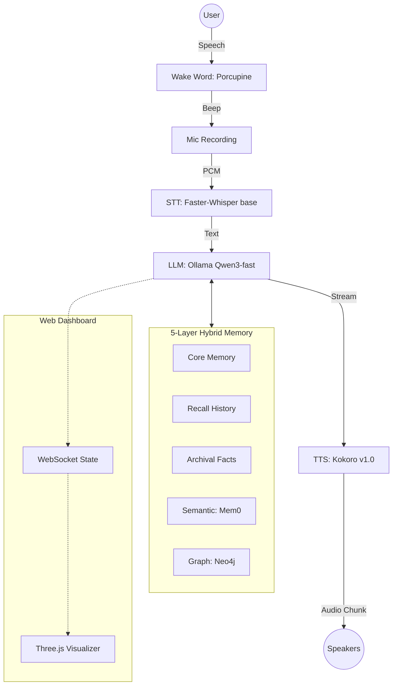

# 🛸 Antigravity: The Ultimate Local AI Friend

[](https://opensource.org/licenses/MIT)
[](https://www.python.org/downloads/)
[](https://ollama.ai/)
[](https://vulkan.org/)

**Antigravity** is a high-performance, fully local voice assistant and "AI Buddy" designed for low-latency interaction and deep personal memory. It doesn't just answer questions—it grows with you, remembers your history, and visualizes its state through a premium 3D web interface.

> [!IMPORTANT]
> **100% Local & Private**: No audio or text ever leaves your machine. Powered by Ollama, Faster-Whisper, and Kokoro TTS.

---

## ✨ Key Features

- **🏎️ Ultra-Low Latency**: Sentence-by-sentence TTS streaming—hear the response *while* the LLM is still generating.
- **🧠 5-Layer Hybrid Memory**: A sophisticated architecture inspired by Letta (MemGPT) and Mem0.
  - **Core Memory**: Fixed persona and human context.
  - **Recall Memory**: Rolling conversation buffer.
  - **Archival Memory**: Structured JSON fact tree.
  - **Semantic Memory**: Vector search over life events (Mem0 + Qdrant).
  - **Knowledge Graph**: Relationship mapping between entities (Neo4j).
- **🤖 Agentic Self-Editing**: The assistant autonomously manages its own memory using internal tags like `[REMEMBER]`, `[UPDATE]`, and `[FORGET]`.
- **🎨 Premium 3D UI**: A stunning Three.js-powered web dashboard with glassmorphism and real-time audio-reactive visuals.
- **🎙️ Robust Voice Pipeline**: Wake-word detection (Porcupine) and highly accurate STT (Faster-Whisper).

---

## 🏗️ Architecture



---

## 🛠️ Tech Stack

| Component | Technology | Description |
|-----------|------------|-------------|
| **LLM Engine** | [Ollama](https://ollama.ai/) | Qwen3-fast model (Vulkan GPU Accelerated) |
| **STT** | [Faster-Whisper](https://github.com/SYSTRAN/faster-whisper) | `base` model with beam search |
| **TTS** | [Kokoro-ONNX](https://github.com/thewh1teagle/kokoro-onnx) | State-of-the-art open-source TTS |
| **Wake Word** | [Porcupine](https://picovoice.ai/platform/porcupine/) | Industry-leading wake word detection |
| **Memory** | Letta + Mem0 + Neo4j | Multi-layered hybrid retrieval system |
| **Backend** | Python / FastAPI | Real-time orchestration and WebSocket streaming |
| **Frontend** | Three.js / CSS | Premium 3D audio-reactive visualizer |

---

## 🚀 Installation

### 1. Prerequisites
- **Python 3.9+**
- **Ollama** (v0.1.30+)
- **Windows** 10/11 (Optimized for AMD GPUs via Vulkan)

### 2. GPU Optimization (AMD)
To enable Vulkan acceleration for Ollama:
```powershell
setx OLLAMA_VULKAN 1
```
*Restart Ollama from the system tray after running this.*

### 3. Setup Models
```bash
# Pull LLM and Embedding models
ollama pull qwen3-fast
ollama pull nomic-embed-text

# Clone and install dependencies
git clone https://github.com/YOUR_USERNAME/Antigravity.git
cd Antigravity
python -m venv venv
source venv/Scripts/activate  # On Windows: venv\Scripts\activate
pip install -r requirements.txt

# Download TTS model files automatically
python setup_models.py
```

### 4. (Optional) Memory Upgrades
For full semantic and graph memory, ensure **Neo4j** is running and install **Mem0**:
```bash
pip install mem0ai
# Setup your NEO4J credentials in .env
```

---

## 🎮 Usage

1. **Start the System**:
   ```bash
   python main.py
   ```
2. **Access the Dashboard**:
   Open `http://localhost:8000` in your browser for the 3D visualizer.
3. **Wake Word**:
   Say **"Porcupine"**. If the 3D visualizer glows and you hear a beep, speak your request.
4. **Personality Switch**:
   You can change the assistant's vibe in `config.py` (Default: `unfiltered`).

---

## 🧩 Configuration

All settings are centralized in `config.py`. 

- `OLLAMA_MODEL`: Change target LLM.
- `WHISPER_MODEL_SIZE`: Swap between `tiny`, `base`, or `small`.
- `KOKORO_VOICE`: Select from a variety of [Kokoro voices](https://huggingface.co/hexgrad/Kokoro-82M).
- `LLM_PERSONALITIES`: Customize how your friend speaks.

---

## 🧠 Memory Self-Editing

The assistant can update its own memory blocks dynamically. You will see tags like these in the terminal (hidden from voice output):
- `[REMEMBER: User loves heavy metal]` -> High-level fact storage.
- `[UPDATE: personal.job=Pilot]` -> Overwrites specific keys.
- `[UPDATE_RELATIONSHIP: We are now best friends]` -> Evolves the friendship block.

---

## ⚖️ License

This project is licensed under the MIT License - see the [LICENSE](LICENSE) file for details.

---

<p align="center">
  Generated with ❤️ by Antigravity AI
</p>
